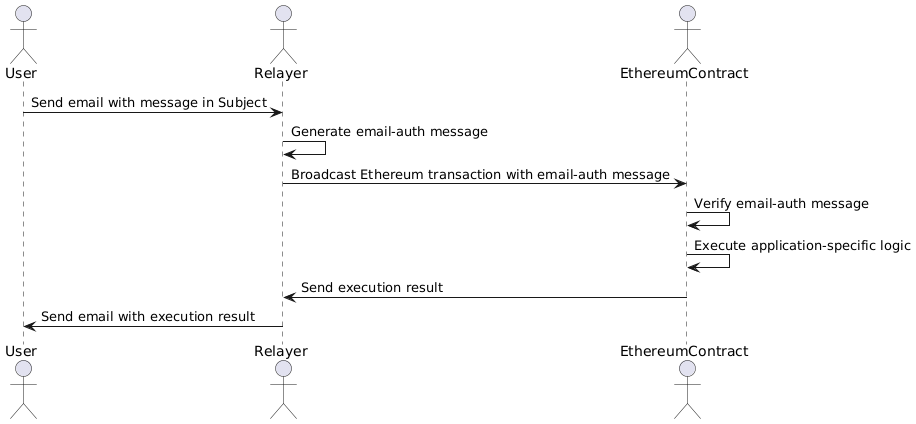
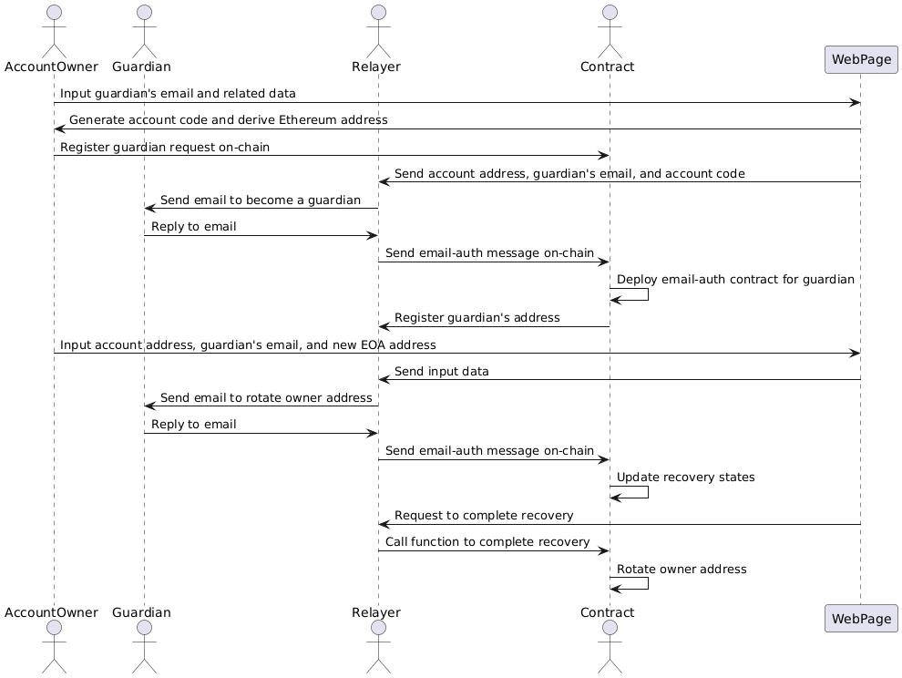

# Ether Email-Auth SDK
## Overview
One issue with existing applications on Ethereum is that all users who execute transactions on-chain must install Ethereum-specific tools such as wallets and manage their own private keys.
Our ether email-auth SDK solves this issue: it allows users to execute any transaction on-chain simply by sending an email.

Using the SDK, a developer can build a smart contract with the following features without new ZKP circuits.
1. (Authorization) The contract can authorize any message in the email body that the user sends with a DKIM signature generated by an email provider, e.g., Gmail. 
2. (Authentication) The contract can authenticate that the given Ethereum address corresponds to the email address in the From field of the email.
3. (Privacy) No on-chain information reveals the user's email address itself. In other words, any adversary who learns only public data cannot estimate the corresponding email address from the Ethereum address.

One of its killer applications is email-based account recovery, social recovery for smart accounts such as Safe, Clave, and so on.
In social recovery, the account owner must appoint trusted persons as guardians who are authorized to update the private key for controlling the account.
However, not all such persons are necessarily Ethereum users.
Our solution mitigates this constraint by allowing guardians to complete the recovery process simply by sending an email.
In other words, any trusted persons can work as guardians as long as they can send emails.
Using the ether email-auth SDK, we construct a library and tools for any smart account providers to integrate our email-based account recovery just by implementing a few Solidity functions and a frontend!

## Architecture
In addition to a user and a smart contract employing our SDK, there is a permissionless server called Relayer.
The Relayer connects the off-chain world, where the users are, with the on-chain world, where the contracts reside, without compromising security.
Specifically, the user, the Relayer, and the contract collaborate as follows:
1. (Off-chain) The user sends the Relayer an email containing a message called command.
2. (Off-chain) The Relayer generates **an email-auth message for the given email, consisting of data about the command, an Ethereum address corresponding to the user's email address, a ZK proof of the email, and so on**.
3. (Off-chain -> On-chain) The Relayer broadcasts an Ethereum transaction to call the contract with the email-auth message.
4. (On-chain) After verifying the given email-auth message, the contract executes application-specific logic according to the command in that message for an Ethereum account derived from the user's email address.
5. (On-chain -> Off-chain) The Relayer sends the user an email to report the execution result of the contract.

## Novel Concepts
### Account Code and Salt
An account code is a random integer in a finite scalar field of BN254 curve. 
It is a private randomness to derive a CREATE2 salt of the user’s Ethereum address from the email address, i.e., `userEtherAddr := CREATE2(hash(userEmailAddr, accountCode))`. 
That CREATE2 salt is called account salt, which is published on-chain.
**As long as the account code is hidden, no adversary can learn the user's email address from on-chain data.** 

### Invitation Code
An invitation code is a hex string of the account code along with a prefix, contained in the email body and inherited by the user's reply.
By confirming that a user sends an email with the invitation code, the contract can ensure that the account code is available to that user. 
It ensures the user’s liveness even when a malicious relayer or another user generates the user's account code because it prevents them from withholding the account code. 
**It suggests that the contract must check if the given email sent by the user contains the invitation code before confirming that user’s account for the first time.**

Notably, the email-auth message, which represents data in the user's email along with its ZK proof, has a boolean field `isCodeExist` such that the value is true if the invitation code is in the email.
However, a command in the email-auth message masks characters for the invitation code.
**Consequently, no information beyond the existence of the invitation code is disclosed.**

### Command Template
Each application defines expected formats for a command in the email body as command templates.
**To define the command templates, a developer does not need to write any ZKP circuits.**

Specifically, the command template is an array of strings, each of which has some fixed strings without space and the following variable parts:
- `"{string}"`: a string. Its Solidity type is `string`.
- `"{uint}"`: a decimal string of the unsigned integer. Its Solidity type is `uint256`.
- `"{int}"`: a decimal string of the signed integer. Its Solidity type is `int256`.
- `"{decimals}"`: a decimal string of the decimals. Its Solidity type is `uint256`. Its decimal size is fixed to 18. E.g., “2.7” ⇒ `abi.encode(2.7 * (10**18))`.
- `"{ethAddr}"`: a hex string of the Ethereum address. Its Solidity type is `address`. Its value MUST be either 0x+lowercase, 0x+uppercase, or 0x+checksumed addresses.

## Package Components
There are four significant packages in this repo:
### `circuits` Package
It has a main circom circuit for verifying the email along with its DKIM signature, revealing a command message that masks an email address and an invitation code, and deriving an account salt from the email address in the From field and the given account code, which should match with the invitation code if it exists in the email.
The circuit is agnostic to application specifications such as command templates.
**Therefore, a developer does not need to make new circuits.**

In a nutshell, our circuit 1) verifies the given RSA signature for the given email header and the RSA public key, 2) exposes a substring between predefined prefix and suffix as a command from the email body while masking the invitation code and email address, and 3) computes the account salt derived from the email address in the From field and the given account code, which must match the invitation code, if present.
This allows our on-chain verifier to authenticate the email sender and authorize the command in the email body while protecting privacy.

For detailed setup instructions, see [here](./packages/circuits/README.md).

### Infrastructure Package
For detailed instructions on how to manage infrastructure metrics and alerts in Google Cloud Platform (GCP), please refer to the [Infrastructure Management Scripts](./infrastructure/README.md) documentation.

### `contracts` Package
It has Solidity contracts that help smart contracts based on our SDK verify the email-auth message. Among them, there are three significant contracts: verifier, DKIM registry, and email-auth contracts.

The verifier contract in `Verifier.sol` has a responsibility to verify the ZK proof in the given email-auth message. 
It is a global contract, that is, multiple users in your application will use the same verifier contract.
You can deploy a new verifier contract once or use the already-deployed contract.

The DKIM registry contract has a responsibility to manage a mapping between an email domain name and its latest public keys used to verify the DKIM signatures. 
It should have mechanisms such that each user or some trusted custodians can rotate and void the registered public keys.
For example, the contract in `ECDSAOwnedDKIMRegistry.sol` requires ECDSA signatures from an owner of the predefined Ethereum address.
If you use the common trusted custodians for all users, you can deploy a new DKIM registry contract once or use the already-deployed contract.
If each user should be able to modify the registered public keys, a new DKIM registry contract needs to be deployed for each user.

The email-auth contract in `EmailAuth.sol` is a contract for each email user.
Its contract Ethereum address is derived from 1) its initial owner address, 2) an address of a controller contract that can define the supported command templates and 3) the account salt, i.e., the hash of the user's email address and one account code held by the user, through CREATE2.
It provides a function `authEmail` to verify the email-auth message by calling the verifier and the DKIM registry contracts.

Your application contract can employ those contracts in the following manner:
1. For a new email user, the application contract deploys (a proxy of) the email-auth contract. Subsequently, the application contract sets the addresses of the verifier and the DKIM registry contracts and some command templates for your application to the email-auth contract. Here, the email-auth contract registers the application contract as a controller contract that has permissions to modify the command templates.
2. Given a new email-auth message from the email user, the application contract calls the `authEmail` function in the email-auth contract for that user. If it returns no error, the application contract can execute any processes based on the message in the email-auth message.

For detailed setup instructions, see [here](./packages/contracts/README.md).

### `relayer` Package
It has a Rust implementation of the Relayer server.
Unfortunately, the current code only supports an application of the email-based account recovery described later.
We will provide a more generic implementation in the future.

For detailed setup instructions, see [here](./packages/relayer/README.md).

### `prover` Package
It has some scripts for a prover server that generates a proof of the main circuit in the circuits package.
The Relayer calls the prover server for each given email to delegate the proof generation.
You can deploy the prover server either on your local machine or [Modal instances](https://modal.com/).

### Security Notes
Our SDK only performs the verification of the email-auth message.
**You have a responsibility to ensure security and privacy in your application.**

Here, we present a list of security notes that you should check.
- As described in the Subsection of "Invitation Code", for each email user, your application contract must ensure that the value of `isCodeExist` in the first email-auth message is true.
- The application contract can configure multiple command templates for the same email-auth contract. However, the Relayer can choose any of the configured templates, as long as the message in the command matches with the chosen template. For example, if there are two templates "Send {decimals} {string}" and "Send {string}", the message "Send 1.23 ETH" matches with both templates. We recommend defining the command templates without such ambiguities.
- To protect the privacy of the users' email addresses, you should carefully design not only the contracts but also the Relayer server, which stores the users' account codes. For example, an adversary can breach that privacy by exploiting an API provided by the Relayer that returns the Ethereum address for the given email address and its stored account code. Additionally, if any Relayer's API returns an error when no account code is stored for the given email address, the adversary can learn which email addresses are registered.

## Application: Email-based Account Recovery
Email-based account recovery can be used to recover any account type, the following representative example will illustrate how to use our SDK to recover an ECDSA-based smart account. We provide contracts and a production Relayer server for email-based account recovery. They assume a life cycle of the account recovery in four phases:
1. (Requesting a guardian) An account owner requests a holder of a specified email address to become a guardian.
2. (Accepting a guardian) If the requested guardian sends an email to accept the request, the Ethereum address of the email-auth contract corresponding to the guardian's email address is registered on-chain.
3. (Processing a recovery for each guardian) When a guardian sends an email to recover the account, the state data for the recovery is updated.
4. (Completing a recovery) If the required condition for the recovery holds, the account recovery is done.

Specifically, we expect the following UX. **Notably, the guardian only needs to reply to emails sent from the Relayer in every process.**
1. (Requesting a guardian 1/4) A web page to configure guardians for email-based account recovery requests the account owner to input the guardian's email address and some related data such as the length of timelock until that guardian's recovery request is enabled. 
2. (Requesting a guardian 2/4) The frontend script on the web page randomly generates a new account code and derives the guardian's Ethereum address from the input guardian's email address and that code. 
It then requests the account owner to send a transaction to register the guardian request on-chain, passing the derived Ethereum address and the related data (not the private data such as the email address and the account code).
3. (Requesting a guardian 3/4) The frontend script also sends the account address, the guardian's email address, and the account code to the Relayer. 
4. (Requesting a guardian 4/4) The Relayer then sends the guardian an email to say "The owner of this account address requests you to become a guardian".
5. (Accepting a guardian 1/3) If confirming the request, the guardian replies to the Relayer's email.
6. (Accepting a guardian 2/3) The Relayer sends an email-auth message for the guardian's email on-chain.
7. (Accepting a guardian 3/3) If the given email-auth message is valid, an email-auth contract for the guardian is deployed, and its address is registered as the guardian.
8. (Processing a recovery for each guardian 1/6) When losing a private key for controlling the account, on the web page to recover the account, the account owner inputs the account address to be recovered, the guardian's email address and a new EOA address called owner address derived from a fresh private key.
9.  (Processing a recovery for each guardian 2/6) The frontend script sends the input data to the Relayer.
10. (Processing a recovery for each guardian 3/6) The Relayer then sends the guardian an email to say "Please rotate the owner address for this account address to this EOA address".
11. (Processing a recovery for each guardian 4/6) If confirming the requested recovery, the guardian replies to the Relayer's email.
12. (Processing a recovery for each guardian 5/6) The Relayer sends an email-auth message for the guardian's email on-chain.
13. (Processing a recovery for each guardian 6/6) If the given email-auth message is valid, the states for the recovery are updated.
14. (Completing a recovery 1/2) When the frontend script finds that the required condition to complete the recovery holds on-chain, e.g., enough number of the guardian's confirmations are registered into the smart account, it requests the Relayer to complete the recovery.
15. (Completing a recovery 2/2) The Relayer sends a transaction to call a function for completing the recovery. If it returns no error, the owner address should be rotated.

### Integration to your Wallet
Using our SDK, you can integrate email-based account recovery into your smart accounts. 
Specifically, it provides an abstract contract in `EmailAccountRecovery.sol` and a Relayer server compatible with that contract, agnostic to the specification of each smart account brand.
In short, by 1) making a contract called **controller** that implements seven missing functions in the abstract contract, and 2) building your frontend to call the controller contract and the Relayer, you can support the email-based account recovery described above. For example, if your wallet supports a module system to extend the wallet functionality, you can make a new module contract for this email-based recovery as the controller. Notably, our SDK **does not** specify concrete account specifications and the logic in the controller **after** verifying the email-auth messages for accepting a guardian and processing a recovery.
Our SDK cannot ensure security and privacy in the entire process without your careful implementation.

Specifically, you can integrate the email-based account recovery into your smart accounts in the following steps.
1. (Contracts 1/6) First, you build a new controller contract with imports of the `EmailAccountRecovery` abstract contract in `EmailAccountRecovery.sol`. Your Solidity compiler will require you to implement the following seven functions: 
`isActivated`,
`acceptanceCommandTemplates`, `recoveryCommandTemplates`, `extractRecoveredAccountFromAcceptanceCommand`, `extractRecoveredAccountFromRecoveryCommand`, `acceptGuardian`, `processRecovery`, and `completeRecovery`.
2. (Contracts 2/6) You define expected command templates for two types of emails sent from guardians, one for accepting the role of the guardian, and the other for confirming the account recovery. You can implement the former and latter command templates in the `acceptanceCommandTemplates` and `recoveryCommandTemplates` functions, respectively. This is an example of the command templates:
    - Template in `acceptanceCommandTemplates`: `"Accept guardian request for {ethAddr}"`, where the value of `"{ethAddr}"` represents the account address.
    - Template in `recoveryCommandTemplates`: `"Set the new signer of {ethAddr} to {ethAddr}"`, where the values of the first and second `"{ethAddr}"`, respectively, represent the account address and the new owner address.
3. (Contracts 3/6) You also define how to extract an account address to be recovered from the command parameters for the templates in `acceptanceCommandTemplates` and `recoveryCommandTemplates`, respectively.
3. (Contracts 4/6) Before implementing the remaining functions in `EmailAccountRecovery`, you implement a requesting function into the controller that allows the account owner to request a guardian, which is expected to be called by the account owner directly. Our SDK **does not** specify any interface or implementation of this function. For example, the function can simply take as input a new guardian's email-auth contract address computed by CREATE2, and store it as a guardian candidate. If you want to set a timelock for each guardian, the requesting function can additionally take the timelock length as input.
4. (Contracts 5/6) You implement the `acceptGuardian` and `processRecovery` functions into the controller. These two functions are, respectively, called by the controller itself after verifying the email-auth messages for accepting a guardian and processing a recovery. Each of them takes as input the guardian's email-auth contract address, an index of the chosen command template, the values for the variable parts of the message in the command, and the email nullifier. You can assume these arguments are already verified. For example, the `acceptGuardian` function stores the given guardian's address as the confirmed guardian, and the `processRecovery` function stores the given new owner's address or sets a timelock.
5. (Contracts 6/6) You finally implement the `completeRecovery` function into the controller. It should rotate the owner's address in the smart account if some required conditions hold. This function can be called by anyone, but is assumed to be called by the Relayer and can take as input arbitrary bytes.
6. (Frontend 1/3) Next, you build a frontend for the account recovery. You prepare a page where the account owner configures guardians. It requests the account owner to input the account address (`account_eth_addr`) and the guardian's email address  (`guardian_email_addr`), generates a random account code (`account_code`), constructs an expected command (`command`) for the command template whose index is `template_idx` in the output of the `acceptanceCommandTemplates()` function. It then requests the account owner to call the requesting function in the controller contract. After that, it calls the Relayer's `acceptanceRequest` API with `guardian_email_addr`, `account_code`, `template_idx`, and the address of the controller contract `controller_eth_addr`.
7. (Frontend 2/3) You also prepare a page where the account owner requests guardians to recover the account. It requests the account owner to input the account address (`account_eth_addr`) and the guardian's email address (`guardian_email_addr`), and constructs an expected command (`command`) for the command template whose index is `template_idx` in the output of the `recoveryCommandTemplates()` function. It calls the Relayer's `recoveryRequest` API with those data and `controller_eth_addr`.
8. (Frontend 3/3) It simulates off-chain if the `completeRecovery` function in the smart account will return no error at regular time intervals. When it stands, the frontend calls the Relayer's `completeRequest` API with sending `account_eth_addr`, `controller_eth_addr`, and a calldata for the `completeRecovery` function `complete_calldata`.  

We show some important points to implement the email-based account recovery for your smart accounts securely.
- **Timelock is strongly recommended.** It allows an account owner who **does not** lose the private key to cancel the processing recovery when malicious guardians start it.
- **A single guardian might be not secure enough** because an adversary can start the recovery only by exploiting that guardian's email account, e.g., stealing the password for that email account. Although the account owner can cancel the recovery, it requires the account owner to become online before the timelock expires.
- **If the main relayer goes down, users cannot continue the recovery until another relayer is available.** The frontend should allow the account owner to choose an arbitrary relayer's email address to improve service availability.

For detailed implementation, see [docs/getting-started.md](./docs/getting-started.md).

Regarding the contract addresses already deployed on Base Sepolia, see [here](./docs/deployed-contracts.md).